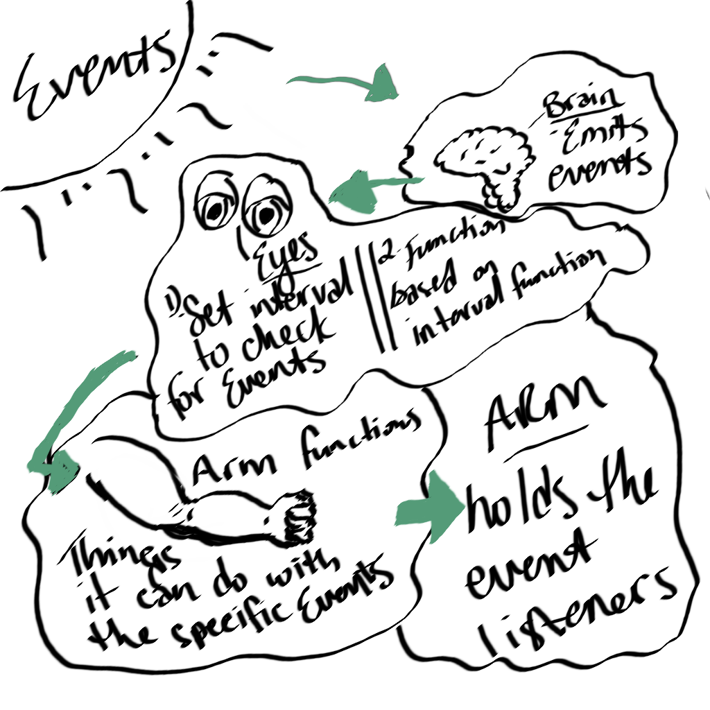

# caps

# LAB - Class 11

## Project: Event Driven Applications

### Author: Ricardo Barcenas

### Links and Resources

- [ci/cd](http://xyz.com) (GitHub Actions)
- [pull request](https://github.com/401-advanced-javascript-ricardo-b/caps/pull/1)

### Setup

#### `.env` requirements (where applicable)

- `STORE` - TBD

#### How to initialize/run your application (where applicable)

- `node caps.js`
- `node driver.js`
- `node vendor.js`

#### How to use your library (where applicable)

#### Tests

- `npm test`

#### UML

Lab UML:
- 

Class UML:
- 